<div align="center">

<h1>
<code>scsv</code>

<br clear="all" />
<a href="https://github.com/AryanAb/scsv/releases"></a>
<a href="/LICENSE"></a>
</h1>

<picture>
	
</picture>

</div>

`scsv` (short for Show Comma-Separated Values) is a command line utility do display csv files neatly.

Features
--------

### Interactive Display

By default, `scsv` will open an interactive window in the terminal that is scrollable using the arrow keys.

```console
$ scsv path_to_file.csv

# Opens a scrollable less window

+++++++++++++++++++++++++++++++
+     col1     |     col2     |
+------------------------------
+     val1     |     val2     |
+++++++++++++++++++++++++++++++
:
```

### Simplified Display

Using the `-s` flag will result in the formatted output to be directly printed to stdout. This is useful for smaller csv files where all the contents could be displayed in the terminal without line wrapping.

```console
$ scsv -s path_to_file.csv
+++++++++++++++++++++++++++++++
+     col1     |     col2     |
+------------------------------
+     val1     |     val2     |
+++++++++++++++++++++++++++++++
```

Contribution
------------

If there is a bug or feature request, please create an issue.

All contributions to the code are welcomed. The code has comments that should make it easier to follow the code. If you don't know what you can contribute to, check the limitation section below.

Limitations
-----------

The current known limitations will hopefully be resolved in a future version of the program.

`scsv` does not check whether the csv file given to it is valid or not. Thus, running `scsv` with an ill-formatted csv file results in undefined behaviour.

Currently, `scsv` formats the file all at once before it buffers it for displaying (using `less` or `cat`). This results in a large processing time for larger files.

Building From Source
------------------

Currently you can't download `scsv` directly from a package manager (aiming to change that very soon). The source code comes with a Makefile that makes it easy to build the program. As long as you have clang installed, you should be able to simply use make.

```console
$ git clone https://github.com/AryanAb/scsv.git
$ cd scsv
$ make
```
